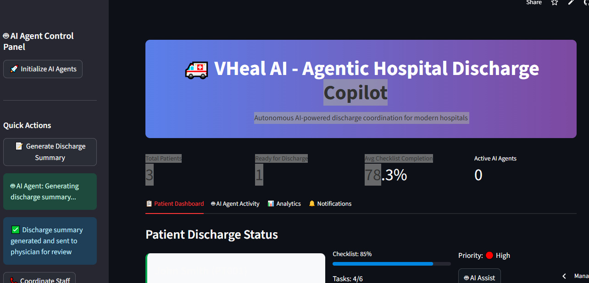
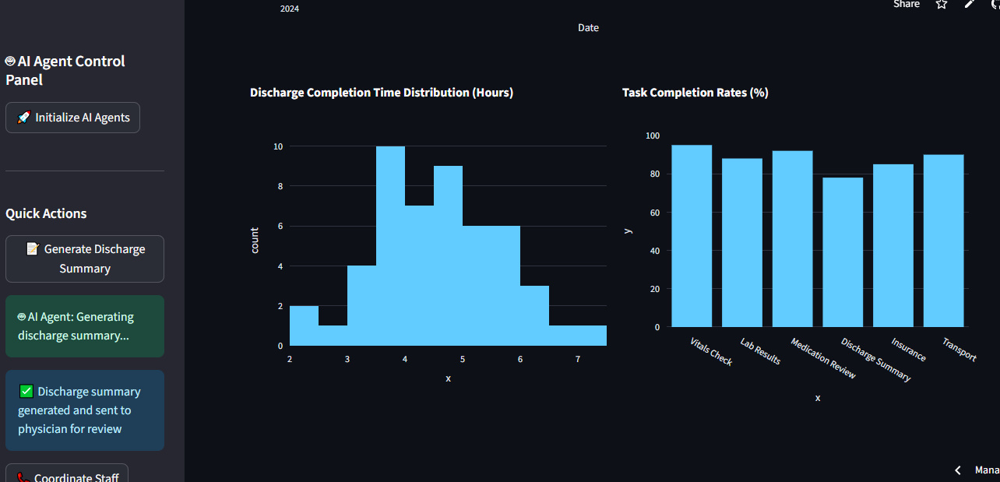
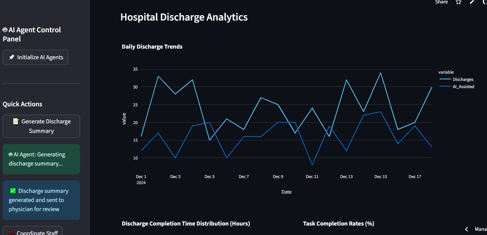

# 🏥 VHeal AI – Agentic Discharge Copilot for Hospitals

> 🧠 **Raise Your Hack 2025 – Paris (Online + Onsite)**  
> 🚀 Built with Agentic AI to automate hospital discharge coordination in real time.  
> ❌ No more delays. ✅ More beds, better care, less burnout.

🔗 **Live Demo:** [https://vheal-ai.streamlit.app](https://vheal-ai.streamlit.app)

---

## 🚨 The Problem: Discharge is Broken

In major hospitals (e.g. Manhattan, Paris), discharge delays are common due to:

- Fragmented handoffs between doctors, nurses, pharmacy, billing  
- Manual summaries and outdated checklists  
- No centralized platform to track readiness or progress

These issues result in:

- ❌ Bed Shortages  
- 😫 Staff Burnout  
- 💸 Higher Patient Costs  
- ⏳ Inefficient Care Delivery

---

## 💡 Our Solution: VHeal AI

**VHeal AI** is an **Agentic AI-powered autonomous discharge assistant** that acts like a digital hospital staff member.

### 👇 What It Does:
- 📍 Detects when patients are ready for discharge  
- 📋 Plans and delegates discharge tasks automatically  
- 🔗 Communicates across departments via APIs & messaging  
- 📊 Displays progress on a real-time dashboard

> "Not reactive. Not rule-based. Truly autonomous."

---

## 🧠 What Makes It Agentic?

| 🔍 Capability            | ✅ Description |
|--------------------------|----------------|
| **Trigger-Based Autonomy** | Starts when a patient is marked "Ready for Discharge" |
| **Multi-Step Reasoning**   | Validates discharge: vitals, meds, labs, signatures |
| **Delegated Communication**| Notifies departments like billing, transport, pharmacy |
| **Tool Use & Memory**      | Uses EMR, staff calendars, previous discharge summaries |
| **Multimodal Interaction** | Operates via dashboard, APIs, WhatsApp, and email |

---

## 🔧 Core Features

- 🧾 **Auto-generated summaries** (GPT-4o, Claude 3, Mistral)  
- ✅ **Checklist Agent** – Labs, meds, vitals  
- 📞 **Smart Alerts** – WhatsApp, Email, SMS to departments  
- 📆 **Discharge Scheduling** – Room + transport availability  
- 📊 **Live Dashboard** – Tracks every agent and staff action  
- 🧠 **Planning Chains** – CrewAI + LangChain multi-agent flow

---

## 🖼️ Product Snapshots

### 📊 Agent Dashboard



---

### 📈 Discharge Analytics View



---

### 💡 Features Overview



---

## 🛠️ Tech Stack

| Layer         | Tools |
|---------------|-------|
| **LLMs & Agents** | GPT-4o, Claude 3, Mistral, LangChain, CrewAI |
| **Backend**   | FastAPI / Node.js |
| **Frontend**  | React.js / Streamlit |
| **Database**  | MongoDB / Firebase |
| **Messaging** | Twilio, WhatsApp Business API |
| **RAG Layer** | Vectara / Weaviate (optional) |

---

## 👥 Team VHeal – [LabLab.ai IDs]

| Name              | ID                   | Role                             |
|-------------------|----------------------|----------------------------------|
| **Eesha Tariq**   | `eesha_tariq899`     | AI Engineer – Agent Logic, LLMs  |
| **Aroob Mushtaq** | `aroobmushtaq818`    | Backend Dev – API Integration    |
| **Arfa Tariq**    | `Arfah_t`            | Researcher – Clinical Workflows  |
| **Zeeshan Tariq** | `zeeshantariqpkn`    | Data Scientist – RAG & Planning  |
| **Waqar Ahmed**   | `WaqarAhmed555`      | Frontend Engineer – Dashboards   |
| **Sujal Bedre**   | `sujal_bedre114`     | Prompt Engineer – LLM Pipelines  |

---

## 🎯 Hackathon Goal – Raise Your Hack, Paris

- ⏳ Automate hospital discharge in <72 hours  
- 🧠 Deploy real-time Agentic AI  
- 🔌 Integrate with APIs like Twilio, Firebase, and EMRs  
- 📊 Present live dashboard + action-based workflows  
- 💡 Show the future of **autonomous care coordination**

> _“We’re not just solving for hospitals — we’re solving for time, care, and cost.”_

---

## ▶️ How to Run Locally

```bash
# 1. Clone the repository
git clone https://github.com/codewithEshaYoutube/Vheal_AI.git
cd Vheal_AI

# 2. Backend setup
cd backend
pip install -r requirements.txt  # or use npm install for Node.js

# 3. Frontend setup
cd ../frontend
npm install
npm run dev

# 4. Add environment variables (.env)
OPENAI_API_KEY=...
TWILIO_API_KEY=...
FIREBASE_CONFIG=...
